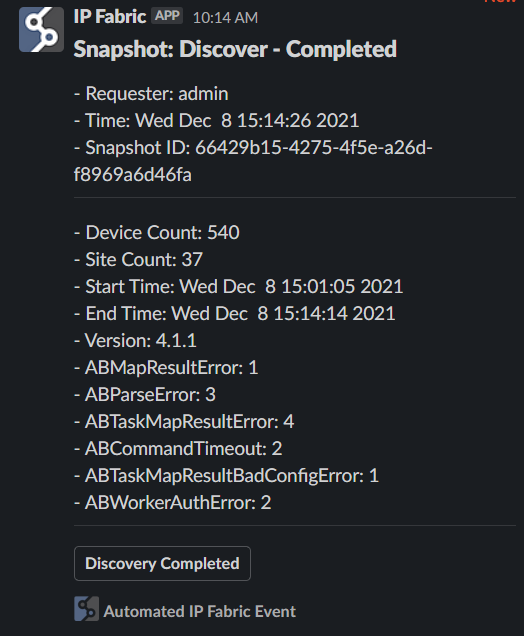

# IP Fabric Webhook Integration for Microsoft Teams and/or Slack

Integrations will be developed under different branches based on the main branch. 
This will allow for easier development and not require installing all packages for integrations 
you do not plan to use.  We will develop an integration video on how to merge different branches into 
a usable product per your environment.

## Setup

### <a id="python-setup"></a> Python Setup
```shell
python3 -m pip install -U pip poetry
poetry install -E notify
```
One time suggested config changes before installing:
```shell
poetry config experimental.new-installer false
poetry config virtualenvs.in-project true
```

If you have any poetry install issues go to `AppData\Local\pypoetry` and delete the `Cache` directory and try again.

### IP Fabric Setup

- Go to Settings > Webhooks > Add webhook
- Provide a name
- URL will be: `http(s)://<YOUR IP/DNS>:8000/ipfabric`
- Copy secret
- Select if you want both Snapshot and Intent Events
  - Recommended for only Snapshot events.

### Environment Setup

- Rename `sample.env` to `.env`
- Edit `.env` with your IPF variables
    - Set `IPF_VERIFY` to False if your IP Fabric SSL cert is not trusted
    - `IPF_SECRET` is found in the webhook settings page
    - `IPF_URL` must be in the following format without any trailing information. For example: `https://demo3.ipfabric.io/`
    - `IPF_TOKEN` is an API token created in Settings > API Token
        - If you want to translate User ID to Username token must have User Management Scope
    - `IPF_TEST` will not send test alerts to the channel when set to `False`
    - Notification Channels (Can send to both locations if both variables are set)
      - `TEAMS_URL` is found when adding an "Incoming Webhook" on a Teams Channel
      - `SLACK_URL` is found when adding an "Incoming Webhook" on a Slack Channel

## Running

### Python

```shell
poetry run api
```

### Docker

```shell
docker-compose up
```

## Examples
### Slack

### Temas
